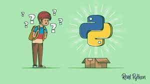

<h2> Hey there! 👋.</h2>

<h2> Welcome to Python 🤓</h2>

Python is one of the most popular programming languages currently. It looks like this trend is about to continue in 2021 and beyond. So, if you are a Python beginner, the best thing you can do is work on some real-time Python project ideas.

<h3> Here are the few of Python Begginer Projects.</h3>
<h3> Go through the Explanations and Do it Your Self </h3>
<h3> if you feel Stuck at any moment check my solutions </h3>

<h1> Thanks </h1>

